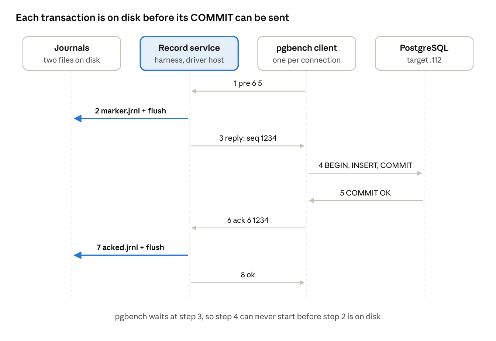

# pgbench Workload in the Resilience Harness

Oct 9, 2026 · Atchayah

## Summary

On the `pgbench` branch, the harness's load comes from **pgbench** (PostgreSQL's standard benchmark client) instead of the harness's own asyncpg load generator. Nothing else changes: the same scenarios, catalog, commands, faults and acceptance rules. Data loss (RPO) is still measured exactly, transaction by transaction.

The hard part was RPO. To count lost transactions, the harness must record every transaction on the driver host **before** its COMMIT is sent, and again **after** the database confirms it. pgbench cannot write files, so each pgbench transaction now starts and ends with a tiny shell command — a *record step* — that asks the harness to write those records. The harness writes them with the same code the built-in generator uses.

**Result on the lab (2026-10-08):** every runnable scenario passed with pgbench, including NL-M-07 at 1000 TPS, where the built-in generator stalled at 369 TPS the day before. NL-M-05 fails on both generators for a reason outside the workload (see *Differences, limitations and open items*). The built-in generator is still there: one flag switches back to it.

## Why the workload is more than "load"

In this harness the workload is the measuring instrument, not just background traffic. Every verdict depends on six things it must deliver:

| # | What the workload must do | Why |
| --- | --- | --- |
| 1 | Record every transaction on the driver host before its COMMIT is sent, and again after the database confirms it | This is how lost transactions (RPO) are counted exactly (Arch §6.2) |
| 2 | Classify every transaction as committed, definitely aborted, or unknown | A transaction cut off by a crash may or may not have committed; counting it as lost would be a false failure |
| 3 | Report throughput and p50/p95/p99 latency every second | Baseline, the pre-fault steady-state check and time-to-SLO are computed from these samples |
| 4 | Keep running through the fault, reconnecting when the database returns | Otherwise post-fault measurements would see an idle database |
| 5 | Produce each scenario's transaction shape (plain inserts, update/delete churn, Elle list-append) | Bloat scenarios need dead rows; NL-C-03 needs a checkable history |
| 6 | Count failed transactions and dropped connections | NL-M-07 and NL-R-04 accept only zero |

Plain pgbench does 3 well and 5 partly. It cannot do 1: it can only talk to the database and run shell commands, so it has no way to write a durable record before each COMMIT. It also drops a client whose connection breaks and never reconnects it (4). The Architecture therefore assigns RPO scenarios to the custom asyncpg driver (Arch §6.1). This branch departs from that on purpose and closes each gap, as the next sections explain.

## The idea: record steps

Every pgbench transaction asks the harness for permission before it starts, and reports back after its COMMIT succeeds. The harness writes a durable record at both moments.

Think of a bank teller who must log every cheque in a ledger before handing it over, and tick it off when the bank confirms payment. If the bank later loses a cheque, the ledger proves it: logged, ticked, but not in the bank's books. pgbench is the teller; the harness keeps the ledger.

In practice:

1. **Before the transaction** (the *pre step*), pgbench runs a one-line shell command that sends `pre` to the harness and waits for an answer.
2. The harness writes the transaction's record to `marker.jrnl` on the driver host, waits until it is safely on disk, then answers with a sequence number.
3. Only then does pgbench send `BEGIN … COMMIT` to the database. It physically cannot send the COMMIT earlier, because it was waiting for that answer.
4. **After a successful COMMIT** (the *ack step*), pgbench sends `ack` to the harness. pgbench only reaches this line if the database confirmed the commit.
5. The harness writes the confirmation to `acked.jrnl`, waits until it is on disk, and answers `ok`. pgbench moves on to its next transaction.



Read it top to bottom: the two highlighted steps are the disk flushes, and the transaction (step 4) sits between them.

The two sides talk through **named pipes** (FIFOs): small special files on the driver host that one program writes into and another reads from. One shared pipe carries all requests; each pgbench process has its own reply pipe.

Because the harness sits in the middle of every transaction, it can also do the jobs pgbench cannot: pace the load, choose keys, classify outcomes and keep the Elle history.

## Components and files

Four new or rewritten modules do the work; the orchestrator, analysis and catalog are unchanged apart from small hooks. Paths are under `resilience_tests/` unless shown otherwise.

| Piece | File | What it does |
| --- | --- | --- |
| Profile setting | `envs/e2-dedicated-vm.yaml` (`workload:`), `control/profile.py` | Chooses `pgbench` or `builtin`, and where the pgbench binary is |
| One-run override | `conftest.py` | `--workload builtin` switches one run back to the built-in generator |
| Factory | `execution/workload/interface.py` | Builds the chosen driver, or refuses with a reason before any load starts |
| pgbench driver | `execution/workload/pgbench_driver.py` | Starts one pgbench process per client, watches them, relaunches dropped clients, counts everything, emits one sample per second |
| Record service (new) | `execution/workload/shell_records.py` | The harness end of the record steps: pacing, sequence numbers, both journals, outcome classification, Elle history; also builds the pre/ack lines of the script |
| Output parser | `execution/workload/pgbench_output.py` | Reads pgbench's error lines: "database cut me off" vs "a record step failed" vs "could not connect" |
| PostgreSQL adapter | `adapters/postgresql/adapter.py` (`pgbench_launch`, `pgbench_marker_uuid`) | The SQL of each transaction shape and how a marker id is computed; the only place that knows PostgreSQL |
| Journals (unchanged) | `execution/workload/markers.py` | `marker.jrnl` and `acked.jrnl`, flushed to disk; the same code the built-in generator uses |
| Built-in generator (unchanged) | `execution/workload/driver.py` | The asyncpg driver, kept as reference and fallback; its rate limiter and constants are reused |
| Orchestrator (small change) | `control/orchestrator.py` | Builds the driver through the factory; records the pgbench facts when the load stops |
| Report (small change) | `analysis/report.py` | Prints the generator, pgbench version, launches and journal flush times |
| Test double | `tests/fakes/fake_pgbench.py`, `tests/fakes/pgbench_env.py` | A fake pgbench that runs the record steps for real against a database kept in files |
| Design record | `specs/002-pgbench-workload-driver/` | Spec, plan, research (decision R1), contracts, tasks, lab results |

The orchestrator calls both drivers the same way: `start`, `wait_until_ready`, `begin_window` / `end_window`, `stop`, a `failure` field, and per-second `sample` events. That shared surface is why no scenario had to change.

## How a scenario run works, phase by phase

The example is NL-C-01 (kill PostgreSQL, 64 clients, 200 TPS), with figures from its lab run on 2026-10-08. The harness and pgbench run on the driver host `.111`; PostgreSQL runs on the target `.112`.

### 1. init (about 1 s)

1. Safety checks: the target must be the allowed lab host, the target lock is taken, and no earlier fault may still be applied.
2. The harness tables (`resilience.markers`, `probe_writes`, `churn`, `elle_lists`) are created if missing and emptied.
3. The factory checks pgbench before anything starts: the binary exists, its major version equals the server's (17), and the adapter supports this scenario's shape. Any failure stops the run here.
4. The two journals are opened on the driver host: `marker.jrnl` and `acked.jrnl`.

### 2. baseline (about 121 s)

1. The harness writes the script `<run_dir>/pgbench/transaction.sql` (the next section shows it) and opens the request pipe.
2. It starts **64 pgbench processes**, one per client. Each holds **one database connection** and runs one transaction at a time.
3. It waits until all 64 have made their first request, waits 1 s more, then measures for 120 s.
4. Lab result: 199.99 TPS, p50 1.9 ms, p99 3.6 ms, journal flush p99 10 ms, 0 errors.

Connections to the database during the run:

| Connection | Count | Purpose |
| --- | --- | --- |
| pgbench clients | 64, held all run | The workload |
| Write probe | 1, held | One `INSERT` every 0.2 s; it decides when the database is writable again (RTO) |
| Reconnect probe | 1, short | Only after a fault, every 0.2 s, until the database accepts connections |
| Harness checks | short | Setup, reading markers at the end, checking no pgbench session is left |

**How often:** 200 TPS means one transaction slot every 5 ms, shared by all 64 clients. Whichever client asks next takes the next slot. On average each client runs one transaction about every 320 ms, but no client is tied to a fixed timetable, and there is no catch-up burst after a delay.

### 3. pre_fault (instant)

The baseline must reach the scenario's floor: at least 150 TPS and p99 at most 300 ms. Otherwise the run stops without injecting the fault and names the slower side: the database, or the driver's journal flush.

### 4. fault_inject

The fault is written to the injection ledger first, then PostgreSQL is killed over SSH. That moment is T0. All 64 connections break.

### 5. recovery (about 61 s)

1. Each pgbench prints "client aborted" and exits. Its unfinished transaction is counted as **unknown** and its connection as **dropped**.
2. One shared probe tries to connect every 0.2 s. As soon as the database accepts connections, all 64 clients are relaunched. In this run that took 128 launches in total: 64 at start plus 64 after the kill.
3. The write probe saw the first successful write 0.67 s after the kill. The load then runs on as before the fault.

### 6. validate

1. The load stops: every pgbench is sent SIGTERM, then SIGKILL after 2 s. The harness confirms that no pgbench process and no pgbench session is left.
2. **RPO:** the harness reads every marker id from the database and compares them with both journals (see *Faults, outcomes and counting*).
3. The integrity check (`pg_amcheck`) runs, and every acceptance rule is evaluated mechanically: `rpo_txn == 0`, `rto_first_write_s <= 60`, `structural_integrity_errors == 0`. All passed.

### 7. report and cleanup

`summary.txt` and `results.json` name the generator, the pgbench version, the number of launches and the journal flush times. The ledger records the fault as reverted, and the target lock is released.

## One transaction, step by step

This is the exact script the harness writes for NL-C-01. pgbench runs it again and again, once per transaction, for the whole run.

```
\setshell tok printf '%s %s %s\n' pre :launch :client 1<>q && read -r a < :reply && echo "$a"
\set seq :tok
BEGIN;
INSERT INTO resilience.markers(uuid, seq, ts) VALUES (md5('resilience-pgbench-NL-C-01-20261008T092214Z-bbe290-' || :seq)::uuid, :seq, clock_timestamp());
COMMIT;
\shell printf '%s %s %s\n' ack :launch :seq 1<>q && read -r a < :reply && test "$a" = ok
```

How to read it:

- Lines starting with `\` are pgbench commands; the others are SQL sent to the database.
- `:name` is a pgbench variable. pgbench replaces it with its value before running the line.
- `\setshell tok …` runs a shell command and stores the number it prints in the variable `tok`. `\shell …` runs a shell command and aborts the client if it fails.
- Line 1 is the **pre step**, lines 3–5 the **transaction** (written by the PostgreSQL adapter), line 6 the **ack step**.
- The run id (`NL-C-01-20261008T092214Z-bbe290`) is written into the script, so every run's marker ids are its own. The sequence number restarts at 1 each run; without the run id, a marker left behind by an earlier run could stand in for one this run lost.

### Worked example

pgbench client **5**, running as launch **6**, was started with `launch=6`, `client=5` and `reply=r/6`.

| Step | Who | What happens |
| --- | --- | --- |
| 1 | pgbench | Writes `pre 6 5` into the request pipe `q`, then waits on its reply pipe `r/6` |
| 2 | harness | Waits for the next free 5 ms slot (the pacing) |
| 3 | harness | Gives this transaction sequence number **1234** and computes its marker id: `512ffad3-d94c-2b56-7a14-9acc4b3c39d6` |
| 4 | harness | Writes `{"seq":1234, "uuid":"512ffad3-…", "t_pre":…}` to `marker.jrnl` and **waits until it is on disk** |
| 5 | harness | Writes `1234` into `r/6` |
| 6 | pgbench | Reads `1234` and sets `seq = 1234` |
| 7 | pgbench → database | `BEGIN`, then the `INSERT` of marker 1234, then `COMMIT` |
| 8 | database | Commits and answers "COMMIT OK" |
| 9 | pgbench | Reaches the ack step (only possible after a successful COMMIT): writes `ack 6 1234` into `q` and waits |
| 10 | harness | Checks that launch 6 really has transaction 1234 in flight |
| 11 | harness | Writes `{"uuid":"512ffad3-…", "t_ack":…}` to `acked.jrnl` and **waits until it is on disk** |
| 12 | harness | Counts one commit, with latency measured from step 5 to step 9, and writes `ok` into `r/6` |
| 13 | pgbench | Sees `ok` and starts the next transaction at step 1 |

The database computes `md5('resilience-pgbench-NL-C-01-20261008T092214Z-bbe290-1234')` as a UUID and stores `512ffad3-…`, the same id the harness computed in step 3. That shared id is what lets the harness later match journal lines to database rows.

What each record proves:

| Record | Meaning |
| --- | --- |
| A line in `marker.jrnl` | The transaction was released and may have reached the database |
| A line in `acked.jrnl` | The database confirmed the commit |
| A row in `resilience.markers` | The commit survived the fault |

The guarantee rests on step 4 finishing before step 7 can begin: **no transaction can commit without a record already on disk**. Each pre and ack step is one short `/bin/sh` on the driver host, about 400 per second at 200 TPS. On the lab this kept p99 latency at 3.6 ms.

## Workload shapes

pgbench supports exactly the shapes the built-in generator supports, with the same SQL in the same order. Each is chosen from the scenario's catalog fields; the scenario never names a generator.

| Catalog setting | Shape | Statements in one transaction | Scenarios |
| --- | --- | --- | --- |
| `profile: oltp_write_heavy` | marker | `BEGIN`; insert one marker row; `COMMIT` | NL-C-01, NL-C-02, NL-C-06, NL-I-01, NL-M-06, NL-M-07, NL-R-04 |
| `profile: mixed` | churn | marker insert, then on the churn table either an `UPDATE` of one row (9 in 10) or a `DELETE` and re-`INSERT` of it (1 in 10) | NL-C-05, NL-M-03, NL-M-05 |
| `history: list_append` | list-append | at `SERIALIZABLE`: marker insert, read list A, append the sequence number to list B, read list B | NL-C-03 |

The catalog's other profiles (`idle`, `oltp_read`, `bulk_load`, `long_analytic`) are not built, and both generators refuse them with the same message.

**How rows and keys are chosen.** A pgbench shell step can only return a single number. So the harness packs everything the transaction needs into that one number (the *token*), and the script unpacks it with simple arithmetic.

- **Marker:** the token is just the sequence number.
- **Churn:** the token packs the sequence number, the churn row (1–2,000) and whether to replace the row. Example: sequence 1234, row 17, update → token = 1234 × 4000 + (17 − 1) × 2 + 0 = 4,936,032. The script divides it back: `seq = 1234`, row `17`, `creplace = 0`, so it runs the `UPDATE`.
- **List-append:** the token packs the sequence number plus the read key and the append key (32 keys, a new set every 4,000 transactions).

The harness picks rows and keys with the built-in generator's own seeded random generators, in the same order. Both generators therefore touch the same rows in the same sequence, and bloat and Elle results stay comparable.

**List-append reads.** Elle must see the values the database actually returned. pgbench captures each read into variables, and after `COMMIT` sends them to the harness through extra shell steps. pgbench refuses a shell command of 255 bytes or more, so a long list travels in chunks of 160 characters, written as offsets from the key window's first value to keep them short. The harness reassembles each read and checks its length. A read that does not reassemble exactly fails the run instead of entering the history.

## Faults, outcomes and counting

Every transaction ends in exactly one of three states. The harness decides which from what it saw, never by guessing.

| Outcome | How the harness knows | Counted as |
| --- | --- | --- |
| Committed | The ack arrived | One commit, with its latency |
| Definitely aborted | The same client sent its next `pre` with no ack in between. pgbench only carries on after a serialization or deadlock error, which the server itself reported | One failed transaction; the connection is kept |
| Unknown | The pgbench process ended while the transaction was in flight | Reported as unknown, never counted as lost or failed; plus one dropped connection |

**When pgbench exits**, the driver reads its error output to decide what happened:

| pgbench said | Meaning | What the harness does |
| --- | --- | --- |
| "client aborted … (SQL) … backend died" or "terminating connection" | The database or the network cut it off | Counts a drop, waits for the database, relaunches the client |
| "client aborted … ERROR: …" | The server rejected a statement; the connection was fine | Counted like the built-in generator (unknown + drop), relaunched, and listed separately in the report with its message. If this happens 3 times before any transaction has ever committed, the script cannot work (a broken statement, a missing privilege): the run stops and names the error |
| "could not create connection" at start | The database is not accepting connections yet (down, starting up, too many clients) | Counts a connection failure, waits, retries |
| "password authentication failed", "no pg_hba.conf entry", "role … does not exist", "permission denied" | The server refuses our credentials or privileges | Stops the run at once, naming the cause: no retry can fix it |
| "client aborted … (shell)" | A record step failed; the database never does this | Fails the run: the evidence path is broken |
| Exited with no error | pgbench stopped by itself | Fails the run |

Other rules, each matching the built-in generator:

- **Relaunch.** Only the dropped clients are relaunched. The healthy ones keep their connections, which is what NL-R-04 and NL-M-07 check. Each relaunch gets a new launch number, and the sequence number keeps counting for the whole run, so no id is ever reused.
- **Stuck transaction.** A watchdog checks every 0.5 s. A transaction in flight for more than 10 s has its client killed; it counts as unknown plus a drop, and the client is relaunched.
- **Last-moment ack.** Before deciding a dead client's outcome, the harness first reads anything the client had already written. An ack sent just before death still counts as committed.
- **Run failure.** If a journal cannot be written, an ack arrives with no matching pre-record, or a list-append read does not reassemble, the run aborts as "workload driver failed". No verdict is given, because the evidence would be incomplete.

**RPO after recovery.** The harness reads every marker id from the database and compares the three sets:

- **lost** = in `acked.jrnl` but missing from the database. This is `rpo_txn`, which must be 0.
- **unknown** = in `marker.jrnl` but not in `acked.jrnl`. These were in flight at the fault; they are reported, not counted.
- **phantom** = in the database but in neither journal: an integrity violation.

A duplicate id, a torn journal line, or an ack without a pre-record aborts the evaluation instead of producing a number. This is the same code as for the built-in generator.

## Configuration and how to run

The generator is chosen in the environment profile, never in a scenario. `envs/e2-dedicated-vm.yaml`:

```
workload:
  generator: pgbench                                       # or: builtin
  pgbench_bin: /usr/lib/postgresql/17.11.1.0/bin/pgbench   # full path
```

What the driver host (`.111`) needs:

- **pgbench of the server's major version** at `pgbench_bin`. Use the full path, because `/usr/bin/pgbench` on Debian is a wrapper that fails here. The lab has ShaktiDB 17.11.1.0.
- **`~/.pgpass`** with the `harness` password and permissions `600`. pgbench (libpq) ignores the file otherwise.
- **`/bin/sh`**, for the record steps.
- **`setpriv`** (util-linux), so a crashed harness takes its pgbench processes with it. Without it, the report states the risk.
- A run directory path with no spaces.

The Python dependencies are the same as before.

Commands, on the harness VM in the harness directory:

```
# unit tests and catalog checks
.venv/bin/python -m pytest tests -q
.venv/bin/python -m catalog.schema --partial

# dry run: starts pgbench and measures a baseline, no fault, no verdict
.venv/bin/pytest resilience_tests/test_scenarios.py --env e2-dedicated-vm --scenario NL-C-01 --stop-before-fault -q -rA

# real run (kills PostgreSQL on .112)
.venv/bin/pytest resilience_tests/test_scenarios.py --env e2-dedicated-vm --scenario NL-C-01 -q -rA

# the same run on the built-in generator
.venv/bin/pytest resilience_tests/test_scenarios.py --env e2-dedicated-vm --scenario NL-C-01 --workload builtin -q -rA

# afterwards: should print nothing
pgrep -fa 'pgbench -n -c 1'
```

The run refuses before any load if pgbench is missing, if its major version differs from the server's, or if the engine cannot run the scenario's shape. It never silently falls back to the other generator.

**Evidence of a pgbench run**, in `~/resilience-runs/<RUN_ID>/`:

- `summary.txt` and `results.json`, with the generator, pgbench version, number of launches and journal flush p50/p99;
- `marker.jrnl` and `acked.jrnl`;
- `events.jsonl`, every per-second sample;
- `pgbench/transaction.sql`, the exact script;
- `pgbench/launch-<n>.txt`, one per pgbench process: its command, how it ended, its error output.

## Testing and lab results

Every runnable scenario passed on the lab with pgbench, and an independent recount of each run's raw evidence matched its report.

### Unit and contract tests

- **Fake pgbench** (`tests/fakes/fake_pgbench.py`): a small stand-in that interprets the script. It runs the record steps through the real `/bin/sh`, so the pipes and failure handling are tested exactly as with real pgbench. Its "database" lives in files, so a test can take it down, make it lose acknowledged commits, cut one client off, hang a commit, or reject commits with serialization errors.
- **Contract tests CT-1 to CT-6** (`tests/test_transaction_record.py`) prove that:
    - the pre-record always comes before the commit;
    - a crash loses nothing;
    - a database that loses acknowledged commits is caught;
    - a failed journal write stops the run;
    - ids never repeat across relaunches.
- **Driver tests** (`tests/test_pgbench_driver.py`, `tests/test_shell_records.py`) cover pacing, partial loss, relaunch, timeouts, Elle reads, cleanup, and two race conditions found during the work.
- **Every orchestrator scenario test runs on both generators.** The pgbench side runs at 8 clients and 40 TPS, because each fake pgbench is a separate Python process.
- Result: 489 tests. On the harness VM a few timing-sensitive tests fail now and then, on both generators, and pass on rerun. The cause is the VM's intermittent slowness, not the code.

### Lab runs, 2026-10-08 (`e2-dedicated-vm`, pgbench 17.11.1.0)

| Scenario | Fault | Result | Baseline TPS | Dropped / relaunched | Unknown | Lost |
| --- | --- | --- | --- | --- | --- | --- |
| NL-C-01 | kill -9 | passed | 199.99 | 64 / 64 | 70 | 0 |
| NL-C-02 | kill during checkpoint | passed | 196.6 | 64 / 64 | 66 | 0 |
| NL-C-03 | kill during 10M-row insert, Elle check | passed | 193.4 | 64 / 64 | 773 | 0 |
| NL-C-05 | 10 kill cycles, bloat | passed | 198.5 | 640 / 640 | 644 | 0 |
| NL-C-06 | kill during index build | passed | 200.0 | 64 / 64 | 66 | 0 |
| NL-I-01 | page corruption | passed | 199.3 | 64 / 64 | 67 | 0 |
| NL-M-03 | 5 autovacuum-worker kills | passed | 198.5 | 320 / 320 | 323 | 0 |
| NL-M-06 | restart | passed (2nd try) | 195.9 | 64 / 64 | 67 | 0 |
| NL-M-07 | config reload at 1000 TPS | passed | 981.2 | 0 / 0 | 28 | 0 |
| NL-R-04 | connection flood | passed (2nd try) | 194.1 | 0 / 0 | 2 | 0 |
| NL-M-05 | idle transaction blocks vacuum | failed (same on built-in) | 197.7 | 0 / 0 | 0 | 0 |
| NL-C-04 | WAL disk full | not runnable: needs a `pg_wal` volume | — | — | — | — |

NL-C-03's "unknown" includes 705 serialization rejections, which count as definitely aborted. The NL-M-05 row comes from its `--workload builtin` comparison run. NL-M-06 and NL-R-04 first aborted before the fault because the driver host's disk flush stalled (journal p99 1.5 s and 3.5 s); both passed on rerun.

### Independent audit of the evidence

Each run's raw files were rechecked, without relying on the report:

- Every acceptance rule recomputed from its values matches the reported outcome.
- The journal recount equals the reported figures. There were 0 duplicate ids and 0 acks without a pre-record, and every ack came after its pre-record.
- Database rows = acknowledged transactions + any unknown ones that turned out committed, with no phantoms. This proves that the harness and the database compute the same marker ids.
- In NL-C-03, none of the 705 values written by aborted transactions appears in any read. So no committed transaction was wrongly marked aborted, and 99% of reads hold two or more values, so Elle had real dependencies to check.
- In NL-M-07 and NL-R-04, every pgbench process ran from start to stop. This independently confirms "0 dropped connections" and "existing sessions unaffected".

## Differences, limitations and open items

The evidence is the same as the built-in generator's; a few measurements differ slightly, and some work remains before merging into `main`.

### What is the same

Same journals and RPO arithmetic, same outcome rules, same pacing, same SQL, same row and key sequence, same per-second samples, same steady-state limits, same timeouts and reconnect interval.

### What differs

| Area | Built-in | pgbench | Effect |
| --- | --- | --- | --- |
| Latency | measured inside one Python process | includes about 1 ms for the ack step's shell | baselines are not directly comparable between generators |
| Latency of a failed attempt | measured exactly | estimated (until the next request, or until the client ended) | p99 during an outage is less exact |
| Constraint violation | definitely aborted; connection kept | pgbench drops the client: unknown + one drop | rare with unique marker ids; would show as a drop |
| `connect_failures` | one per worker attempt | one per shared probe attempt | smaller numbers; still above 0 when connections fail |
| Reconnect | about 0.2 s | a new process, tens of ms more | load resumes slightly later |
| Driver host load | 1 process | 64 pgbench processes + about 400 short shells per second at 200 TPS | sustained 1000 TPS on the lab |

### Is this "the standard approach"?

Partly. pgbench itself is used the standard way: custom scripts with `-f`, one client per process, `-n`, `--max-tries=1`, libpq connections. The record steps are a **custom extension**: pgbench was not built to write records before each commit. The Architecture's default is pgbench for baselines and soak tests, and the asyncpg driver for RPO (Arch §6.1). This branch departs from that on purpose, recorded in `research.md` R0/R1. Its correctness rests on the tests and lab evidence above, not on convention.

### Known limitations and findings

- The **driver host's disk flush stalls** from time to time (once for 1.5–3.5 s on the lab). When it happens during a baseline, the run aborts before the fault, as designed. The same applies to the built-in generator.
- **NL-M-05 fails on both generators.** The target has `idle_in_transaction_session_timeout = 0`, which the harness observes but never changes, and no bloat-alert source is connected. The workload's part was correct.
- **NL-I-01 reports `dropped_connections = 0`** although the fault's restart dropped all 64 clients. They dropped just before the moment the orchestrator marks as the fault time. No acceptance rule uses this value. It affects both generators.
- **NL-R-04 had a 2.25 s gap** in the per-second samples during the connection flood. It does not affect the verdict, but it is above the spec's 1.5 s target and is not yet explained.
- An old **NL-C-04 run** (Oct 1, before this branch) was checked by a substitute checker on an invalid history. Do not use it as evidence. The current code no longer has that checker.

### Open items before merging into main

- [ ] Run each scenario once more with `--workload builtin` on the same day, for a side-by-side table (task T051)
- [ ] Repeat the pgbench runs 2–3 times to show stability
- [ ] Explain the NL-R-04 sample gap
- [ ] Report the NL-I-01 drop-count window to the scenario's owner
- [ ] Review by the scenarios' owner (Gowri)
- [ ] Bring the branch up to date with `main` by re-applying the changes, not trusting an auto-merge of `orchestrator.py` and `adapter.py`; then rerun the scenarios the merge touches

## Glossary

| Term | Meaning |
| --- | --- |
| pgbench | PostgreSQL's standard benchmarking client; runs a script of SQL and meta-commands over and over |
| Built-in generator | The harness's own asyncpg load driver (`driver.py`), still available with `--workload builtin` |
| Driver host | The machine that runs the harness and the load (`.111`), separate from the database under test |
| Target | The database under test (`.112`) |
| Client / launch | A client is one of the declared concurrent workers; a launch is one pgbench process for that client. A client gets a new launch after each drop |
| Record step | A shell command in the pgbench script that talks to the harness: the *pre step* before the transaction, the *ack step* after a successful COMMIT |
| Record service | The part of the harness that answers record steps (`shell_records.py`) |
| Named pipe (FIFO) | A special file that one program writes into and another reads from; used for requests (`q`) and replies (`r/<launch>`) |
| Token | The single number the pre step returns: the sequence number, plus churn or Elle keys packed in |
| Marker | One row in `resilience.markers` per transaction, with a unique id; the unit RPO is counted in |
| `marker.jrnl` / `acked.jrnl` | The two journals on the driver host: written before the COMMIT is sent / after the database confirmed it, each flushed to disk |
| RPO (`rpo_txn`) | Transactions the database confirmed but lost: in `acked.jrnl`, missing from the database |
| Unknown (indeterminate) | A transaction in flight when the connection broke; it may or may not have committed, so it is reported and never counted |
| Definitely aborted | The server explicitly rejected the transaction (serialization or deadlock) |
| RTO | Time from the fault until the database takes writes again, measured by the harness's write probe |
| Shape | The kind of transaction a scenario needs: marker, churn or list-append |
| Elle / list-append | Jepsen's anomaly checker, and the transaction pattern (appends to lists plus reads) that it checks |
| Watchdog | The harness check that abandons a transaction in flight for more than 10 s |
